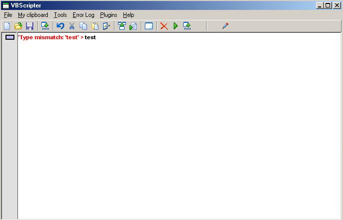



## VBScripter 1\.0

### Description

This application has vbscript debugging, colorizing, previewing vbscript, nice toolbar, plug-ins (if you want to include plugins, make the directory named 'plugin' and insert it there) They are not actually plugins. Output=>Clipboard Contents! Whatever! Check it out. Look at the screenshot. Rate it.
 
### More Info
 

             |
---                |---
**Submitted On**   |2003-10-17 22:33:28
**By**             |[vb876](https://github.com/Planet-Source-Code/PSCIndex/blob/master/ByAuthor/vb876.md)
**Level**          |Intermediate
**User Rating**    |5.0 (35 globes from 7 users)
**Compatibility**  |VB 6\.0
**Category**       |[Complete Applications](https://github.com/Planet-Source-Code/PSCIndex/blob/master/ByCategory/complete-applications__1-27.md)
**World**          |[Visual Basic](https://github.com/Planet-Source-Code/PSCIndex/blob/master/ByWorld/visual-basic.md)
**Archive File**   |[VBScripter16775611292003\.zip](https://github.com/Planet-Source-Code/vb876-vbscripter-1-0__1-49308/archive/master.zip)

